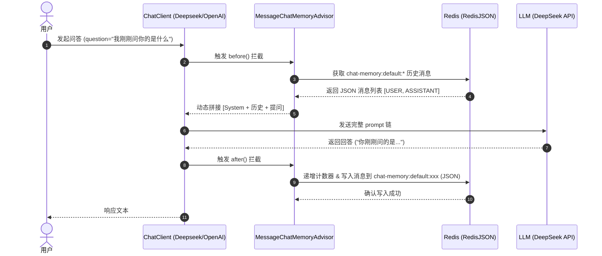

# Chat Session Memory Sequence Diagram

```mermaid
sequenceDiagram
    autonumber
    actor 用户
    participant ChatClient as ChatClient (Deepseek/OpenAI)
    participant Advisor as MessageChatMemoryAdvisor
    participant Redis as Redis (RedisJSON)
    participant LLM as LLM (DeepSeek API)

    用户->>ChatClient: 发起问答 (question="我刚刚问你的是什么")
    ChatClient->>Advisor: 触发 before() 拦截
    Advisor->>Redis: 获取 chat-memory:default:* 历史消息
    Redis-->>Advisor: 返回 JSON 消息列表 [USER, ASSISTANT]
    Advisor-->>ChatClient: 动态拼接 [System + 历史 + 提问]

    ChatClient->>LLM: 发送完整 prompt 链
    LLM-->>ChatClient: 返回回答 ("你刚刚问的是...")

    ChatClient->>Advisor: 触发 after() 拦截
    Advisor->>Redis: 递增计数器 & 写入消息到 chat-memory:default:xxx (JSON)
    Redis-->>Advisor: 确认写入成功
    ChatClient-->>用户: 响应文本
```
