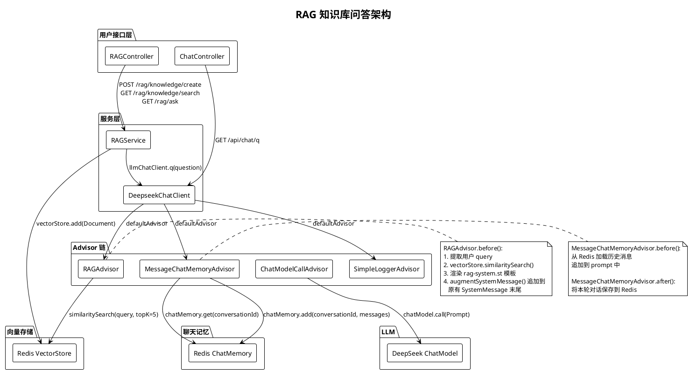
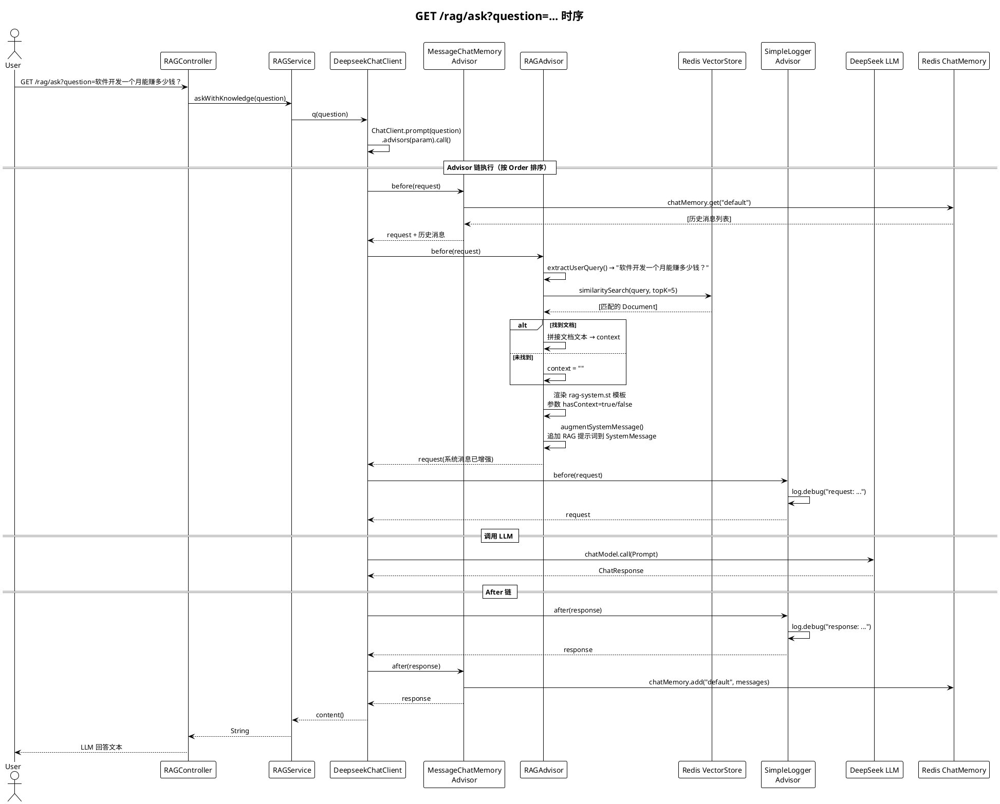
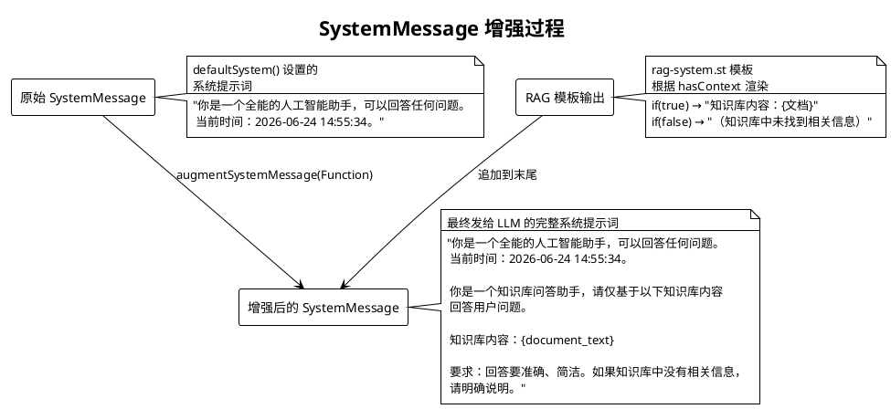
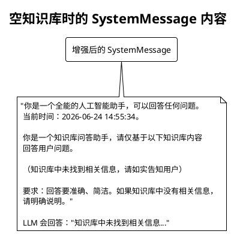
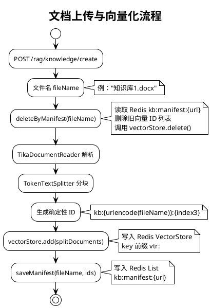
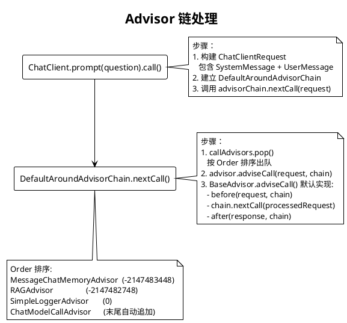

# RAG 知识库上传使用指南

本指南介绍如何将文档上传到服务端进行解析与向量入库，并说明中文文件名与重复上传的处理策略。

## 1. 前置条件
- JDK 25+、Maven 3.9+
- Redis（建议使用本仓库的 redis-stack）：
  - 启动：`docker-compose up -d`
  - UI: http://localhost:8380  密码：`your-pwd`
- 应用：`mvn spring-boot:run -pl mcp-client`

## 2. 接口说明
- URL: `POST http://localhost:8081/rag/knowledge/create`
- Content-Type: `multipart/form-data`
- 表单字段：
  - `file`：需要上传的文档（推荐 `.docx`）
- 行为：
  - 使用 Apache Tika 解析 `.docx` 文本
  - 使用向量数据库（Redis）存储向量；按文档名进行"幂等覆盖"，重复上传仅保留最新一版

## 3. 中文文件名的正确传递（IDEA HTTP Client 示例）
在 `help/api/http-requests.http` 中使用如下写法，确保中文文件名不会乱码：

```
POST http://localhost:8081/rag/knowledge/create
Content-Type: multipart/form-data; boundary=WebAppBoundary

--WebAppBoundary
Content-Disposition: form-data; name="some-key"
Content-Type: text/plain

some-value
--WebAppBoundary
Content-Disposition: form-data; name="file"; filename="zhishiku1.docx"; filename*=UTF-8''%E7%9F%A5%E8%AF%86%E5%BA%931.docx
Content-Type: application/vnd.openxmlformats-officedocument.wordprocessingml.document

< ./知识库1.docx
--WebAppBoundary--
```

说明：
- `filename*` 为 RFC 5987 语法，值需使用 UTF-8 百分号编码（示例代表"知识库1.docx"）。
- 同时提供 ASCII 回退的 `filename` 以兼容部分客户端/服务器。

## 4. Postman 上传要点
- Body 选择 `form-data`
- Key 为 `file`，Type 选择 `File`
- 选择本地文件 `知识库1.docx`
- 如需显式设置 `filename*`，可在 `Headers` 或 `cURL` 中构造；多数情况下 Postman 直接选择文件即可。

## 5. cURL 示例（可选）
```
curl -X POST "http://localhost:8081/rag/knowledge/create" \
  -H "Content-Type: multipart/form-data" \
  -F "file=@./知识库1.docx;filename*=UTF-8''%E7%9F%A5%E8%AF%86%E5%BA%931.docx"
```

## 6. 去重与幂等覆盖（重要）
为避免重复调用导致向量累积，系统对同名文件进行"幂等覆盖"：
- 每个分片使用稳定 ID：`kb:{urlencode(fileName)}:{index3}`
- 写入前读取并删除上次的 ID 清单（Redis List：`kb:manifest:{urlencode(fileName)}`）
- 写入后保存新一版清单
- 结果：重复上传同名文件，只保留最新一批向量

## 7. 验证
- 控制台日志可看到：
  - 首次：`Split documents.size()=M`
  - 再次上传同名文件：`delete old documents size=N`，随后 `Split documents.size()=M`
- 在 Redis Stack UI 搜索前缀 `vtr:`，应只看到最新一批向量

## 8. 编码与解析注意事项
- 全链路 UTF-8；Windows 终端建议使用 PowerShell 或设置 UTF-8 输出
- 文本解析通过 Apache Tika；推荐 `.docx`，旧 `.doc` 解析效果依赖文档本身

---

# RAG 架构设计

## 整体架构



## 查询链路时序



## SystemMessage 增强过程



## Fallback 行为

当 `hasContext=false`（知识库无匹配文档）时，模板走 `{else}` 分支：



## 文档上传流程



## 核心类说明

| 类 | 位置 | 职责 |
|------|------|------|
| `RAGController` | `mcpclient.controller.RAGController` | 暴露 `/rag/*` REST 接口 |
| `RAGService` | `mcpclient.service.impl.RAGService` | 文档解析、分块、向量存储、检索全流程 |
| `DeepseekChatClient` | `mcpclient.service.impl.DeepseekChatClient` | LLM 调用入口，注册 Advisor 链 |
| `RAGAdvisor` | `mcpclient.component.RAGAdvisor` | `BaseAdvisor` 实现，相似搜索 + 提示词增强 |
| `MessageChatMemoryAdvisor` | Spring AI 内置 | 聊天记忆加载/持久化 |
| `SimpleLoggerAdvisor` | Spring AI 内置 | 记录请求/响应日志 |
| `rag-system.st` | `resources/prompts/rag-system.st` | RAG 提示词 StringTemplate |
| `chat-system.st` | `resources/prompts/chat-system.st` | 主系统提示词 StringTemplate |

## 模板渲染规则

模板 `rag-system.st`：
```st
你是一个知识库问答助手，请仅基于以下知识库内容回答用户问题。

{if(hasContext)}
知识库内容：
{context}
{else}
（知识库中未找到相关信息，请如实告知用户）
{endif}

要求：回答要准确、简洁。如果知识库中没有相关信息，请明确说明。
```

| hasContext | context | 渲染结果 |
|-----------|---------|---------|
| `true` | 文档全文 | 知识库内容：\n{文档原文} |
| `false` | `""` | （知识库中未找到相关信息，请如实告知用户） |

注意：使用 `hasContext` boolean 而非直接判断 `{if(context)}`，因为 StringTemplate 将空字符串视为 truthy，会导致 `{else}` 分支永不执行。

## Spring AI 2.0.0 Advisor 链机制


